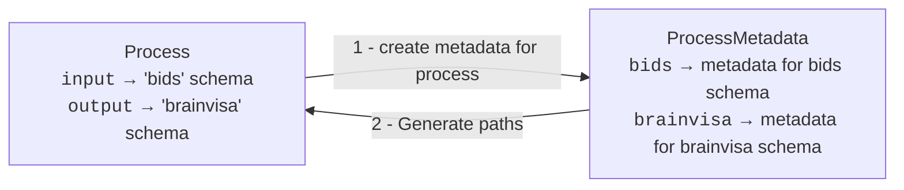

# Path generation API

We call path generation the automatic creation of paths values for a process instance. This document describes the path generation system of Capsul.


## General principles

The path generation system is designed to be **fully automatic**. Path generation must not need any user input except the selection of a few input parameters of the process. This is important to be able to use path generation on iteration of hundreds of executions.

Path generation is done using **metadata and metadata schema**. The metadata contains the values that are used to build various part of the path. For instance, the subject code is often used in path names as well as an extension defining the file type. These two values are included in the metadata. There is no single way to create a path given metadata. There are many possible layouts for path names using various metadata. For instance, BrainVISA has defined a path organisation layout. BIDS is another path organisation layout that is the actual standard for neuroimaging. Capsul can support many different systems; each one beign defined in a `MetadataSchema` class (see below).

Metadata given to create a path name can have **various origins**. For instance, the extension of the file is most often dependent on the process. An image parameter uses an image extension (such as `.nii`) whereas a mesh parameter uses a mesh format (such as `.gii`). This kind of metatada, called **process metadata**, is **defined globally for a process**, usually by the process developer. On the other hand, metadata such a subject identifier depends on the usage context of the process. This kind of metadata is called **user metadata** because it is **given at runtime** as the result of a user action (manual, entry, database selection, etc.).

The path generation system must be able to deal with **several metadata schemas for a single process**. If not it woul mean that all process parameters must be in the same schema. This is the case if all input and output data are following the BIDS standard. However, in many cases a process will have to deal with several metadata schemas. For instance, there could be one schema for input data (i.e. BIDS), another schema for output data (for use cases not covered by BIDS) and other schemas for third party data (for instance template images in SPM software directory). To support several metadata schema, Capsul make a link between a dataset (i.e. a directory) and the metadata schema used throughout that directory using he `Dataset` class.

### Using path generation

Path generation is done for all path parameters of a process. The following diagram illustrate the case of a process with one `input` parameter supposed to follow BIDS schema and one `output` parameter following another schema called BrainVISA. In oder to use path generation, the user must create a ̀ProcessMetadata` instance that allows to set user metadata for all schemas used by the process. These user metadata are combined with process metadata in order to generate values for all path parameters.



## Datasets and relative directory reference

In Capsul, during a process creation, the authors can define how many different datasets the process will use. For instance, a normalization process could be defined with three datasets : one for input data, one for output data and one containing normalization templates. Except the list of datasets, no other information is known about them at process creation time (neither the base path of the dataset nor the schema it uses). Therefore, a process simply defines one name for each dataset it uses. By default, two datasets are defined : ̀`input` for input files and `output`for output files. But a processes can define there own dataset symbolic names. For instance `SPM templates` could be used to designate the directory containing the template images bundled with the SPM software. Of course, it is necessary that all processes uses the same symbolic name for a given directory.

To be able to do something with a dataset name, one must know two things:
* What is the path of the base directory for this dataset ?
* How the file names are organized in this directory ? In other words, what is the metadata schema associated with this dataset.

This information depends on the execution environment. Indeed, the path of a directory that will be used by a process may only be valid on the execution environment. If the user is on a remote computer this path may be invalid on this machine. Therefore, the link between a dataset global name and its actual location and schema is done in Capsul's execution environment configuration. This configuration contains a series of `Dataset` objects making the link between the global name and the base path location as well as the metadata schema. A metadata schema represents the orgranization of the paths within the dataset. For instance their is a metadata schema for BIDS organization. Each metadata schema is a subclass of `MetadataSchema` that derives from `Controller`. A schema contains controller fields describing the metadata that can be used to create a single path. For instance, a BIDS dataset class could be defined as follows:

```
class BIDSSchema(MetadataSchema):
    ''' Metadata schema for BIDS datasets
    '''
    schema_name = 'bids'

    folder: Literal['sourcedata', 'rawdata', 'derivative']
    process: str = None
    sub: str
    ses: str
    data_type: str = None
    task: str = None
    acq: str = None
    ce: str = None
    rec: str = None
    run: str = None
    echo: str = None
    part: str = None
    suffix: str = None
    extension: str

    def _path_list(self, unused_meta=None):
        '''
        The path has one of the following pattern:
          {folder}/sub-{sub}/ses-{ses}/{data_type}/sub-{sub}_ses-{ses}[_task-{task}][_acq-{acq}][_ce-{ce}][_rec-{rec}][_run-{run}][_echo-{echo}][_part-{part}]{modality}.{extension}
          derivative/{process}/ses-{ses}/{data_type}/sub-{sub}_ses-{ses}[_task-{task}][_acq-{acq}][_ce-{ce}][_rec-{rec}][_run-{run}][_echo-{echo}][_part-{part}]{modality}.{extension}
        '''
        path_list = [self.folder]
        if self.process:
            if not self.folder:
                self.folder = 'derivative'
            elif self.folder != 'derivative':
                raise ValueError('BIDS schema with a process requires folder=="derivative"')
            path_list += [self.process]
        path_list += [f'sub-{self.sub}',
                      f'ses-{self.ses}']
        if self.data_type:
            path_list.append(self.data_type)
        elif not self.process:
            raise ValueError('BIDS schema requires a value for either '
                             'data_type or process')

        filename = [f'sub-{self.sub}',
                    f'ses-{self.ses}']
        for key in ('task', 'acq', 'ce', 'rec', 'run', 'echo', 'part'):
            value = getattr(self, key, undefined)
            if value:
                filename.append(f'{key}-{value}')
        if self.suffix:
            filename.append(f'{self.suffix}.{self.extension}')
        else:
            filename[-1] += f'.{self.extension}'
        path_list.append('_'.join(filename))
        return path_list

```

The fields are the various elements that one can find in a complete BIDS path. Given valid values for these fields, it is possible to build any valid BIDS paths (relative to a base path).

## Simple example

```python
from capsul.api import Capsul, Process
from capsul.dataset import ProcessMetadata, ProcessSchema

from soma.controller import field, File


class SegmentHemispheres(Process):
    input: File
    voronoi: field(type_=File, write=True)
    left_output: field(type_=File, write=True)
    right_output: field(type_=File, write=True)


class SegmentHemispheresBids(ProcessSchema,
                            schema='bids',
                            process=SegmentHemispheres):
    _ = {
        '*': {
            'process': 'segment_hemispheres',
            'extension': 'nii'
        }
    }
    voronoi = {'suffix': 'voronoi'}
    left_output = {'suffix': 'lhemi'}
    right_output = {'suffix': 'rhemi'}


if __name__ == '__main__':
    config = {
        'builtin': {
            'dataset': {
                'input': {
                    'path': '/input',
                    'metadata_schema': 'bids',
                },
                'output': {
                    'path': '/output',
                    'metadata_schema': 'bids',
                },
            }
        }
    }
    capsul = Capsul()
    capsul.config.import_dict(config)
    process = Capsul.executable('__main__.SegmentHemispheres')
    engine = capsul.engine()
    execution_context = engine.execution_context(process)
    metadata = ProcessMetadata(process, execution_context)
    metadata.bids.folder = 'derivative'
    metadata.bids.sub = 'thesubject'
    metadata.bids.ses = 'thesession'
    metadata.generate_paths(process)

    print('Paths before execution:')
    for field in process.user_fields():
        value =  getattr(process, field.name)
        print(field.name, f"= '{value}'",)

    print('Paths during execution:')
    process.resolve_paths(execution_context)
    for field in process.user_fields():
        value =  getattr(process, field.name)
        print(field.name, f"= '{value}'",)
```

In this example, a fake process with one input parameter and three outputs is created. Then the `SegmentHemispheresBids` definition gives the BIDS specific metadata for this process. This metadata indicate that when a `BIDSSchema` is created for this process, two attributes will be set for all parameters: `process='segment_hemisphere'` and `extension='nii'`; and each output parameter have its own `suffix` value.

A configuration is created containing two datasets for the symbolic names `input` and `output`. These dataset names are used by default for input and output parameters.

After the creation of a process instance and an execution context, a `ProcessMetadata` class is created, some user metadata attributes are set (BIDS values for `folder`, `sub`, `ses`) and `generate_paths()` is called to create path values for each parameters given process and user and metadatas.

Finally, this script prints the process parameters twice. The output is:
```
Paths before execution:
input = '!{dataset.input.path}/derivative/segment_hemispheres/sub-thesubject/ses-thesession/sub-thesubject_ses-thesession.nii'
voronoi = '!{dataset.output.path}/derivative/segment_hemispheres/sub-thesubject/ses-thesession/sub-thesubject_ses-thesession_voronoi.nii'
left_output = '!{dataset.output.path}/derivative/segment_hemispheres/sub-thesubject/ses-thesession/sub-thesubject_ses-thesession_lhemi.nii'
right_output = '!{dataset.output.path}/derivative/segment_hemispheres/sub-thesubject/ses-thesession/sub-thesubject_ses-thesession_rhemi.nii'
Paths during execution:
input = '/input/derivative/segment_hemispheres/sub-thesubject/ses-thesession/sub-thesubject_ses-thesession.nii'
voronoi = '/output/derivative/segment_hemispheres/sub-thesubject/ses-thesession/sub-thesubject_ses-thesession_voronoi.nii'
left_output = '/output/derivative/segment_hemispheres/sub-thesubject/ses-thesession/sub-thesubject_ses-thesession_lhemi.nii'
right_output = '/output/derivative/segment_hemispheres/sub-thesubject/ses-thesession/sub-thesubject_ses-thesession_rhemi.nii'
```

First, the parameters are printed as they are created by `generate_paths()`. These paths (starting with `!` character) are using expressions that will be resolved at runtime using the execution context. This allows to make paths that uses symbolic dataset names (`input` and `output` in this case) and can be used on client side independently of the final configuration.

Then, the final real path value after the resolution of special expressions is printed.
